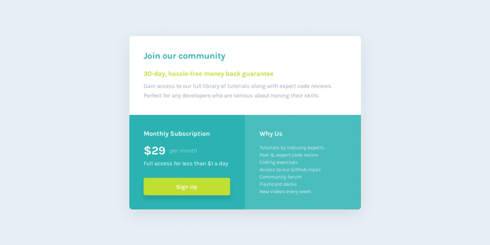

# Frontend Mentor - Single price grid component challenge

This is a solution to the [Single price grid component challenge on Frontend Mentor](https://www.frontendmentor.io/challenges/single-price-grid-component-5ce41129d0ff452fec5abbbc). Frontend Mentor challenges help you improve your coding skills by building realistic projects.

## Table of contents

- [Overview](#overview)
  - [The Challenge](#the-challenge)
  - [Screenshot](#screenshot)
  - [Links](#links)
    - [My Process](#my-process)
      - [Build with](#built-with)
      - [What I learned](#what-i-learned)
      - [Continued Development](#continued-development)
      - [Useful Resources](#useful-resources)
- [Author](#author)
- [Acknowledgments](#acknowledgments)

## Overview

### The Challenge

Users should be able to:

- View the optimal layout for the component depending on their device's screen size
- See a hover state on desktop for the Sign Up call-to-action

### Screenshot



### Links

- Solution URL: [Solution](https://www.frontendmentor.io/solutions/single-price-grid-component-using-css-grid-4c7HG8rNH-)
- Live Site URL: [Live](https://grifano.github.io/FM__Single-price-grid-component/)

## My process

### Built with

- Semantic HTML5 markup
- CSS custom properties
- SASS/SCSS
- Flexbox
- CSS Grid
- Responsive Web Design

### What I learned

I'm using the ul element to create a grid. Not sure, about using ul... but it's really easy to play with grid items (li).

```html
<ul class="join__grid">
  <li>
    <div class="subscription">...</div>
  </li>
  <li>
    <div class="why-us">...</div>
  </li>
</ul>
```

Auto-fit and minmax together create a responsive layout. The grid items fill the grid container equally, but only if the grid container is large enough to contain 240px minimum width for each. And, if they do not fit, they jump to the next row and stretch.

```css
&__grid {
  color: $white;
  list-style: none;
  display: grid;
  grid-template-columns: repeat(auto-fit, minmax(240px, 1fr));
  li {
    padding: 40px;
    background-color: #2bb3b1;
    &:last-child {
      background-color: #4abebd;
    }
    @media (max-width: 768px) {
      padding: 24px;
    }
  }
}
```

### Continued development

I'm focusing on improving my programming skills with HTML&CSS and JavaScript. My plan is to get comfortable with the basics before I going to dive into the Frontend framework/library like React, Angular, Vue, etc.
I hope that such amzing tools like [Frontend Mentor](https://www.frontendmentor.io/) and [Uxcel](https://uxcel.com?invite=EE4PBID94EEH) help me with my this.

### Useful resources

[CSS-TRICKS](https://css-tricks.com/auto-sizing-columns-css-grid-auto-fill-vs-auto-fit/) - Auto-Sizing Columns in CSS Grid: `auto-fill` vs `auto-fit`. Fill or Fit? What’s the difference?
[Frontend Mentor](https://www.frontendmentor.io/) - Get a challenge and try to make them as close to a mockup as you can.  
[Uxcel](https://uxcel.com?invite=EE4PBID94EEH) - improv UX/UI Design skills, by reading the article and check your new knowledge by passing a quiz.

## Author

- Website - [Serhii "Gr[i]fano" Orlenko"](https://grifano.webflow.io/)
- Frontend Mentor - [@Grifano](https://www.frontendmentor.io/profile/Grifano)
- Twitter - [@Grifano](https://twitter.com/OrlenkoSerhii)
- LinkedIn - [@Grifano](https://www.linkedin.com/in/serhii-orlenko-44aaa4a3/)

<!-- ## Acknowledgments -->
